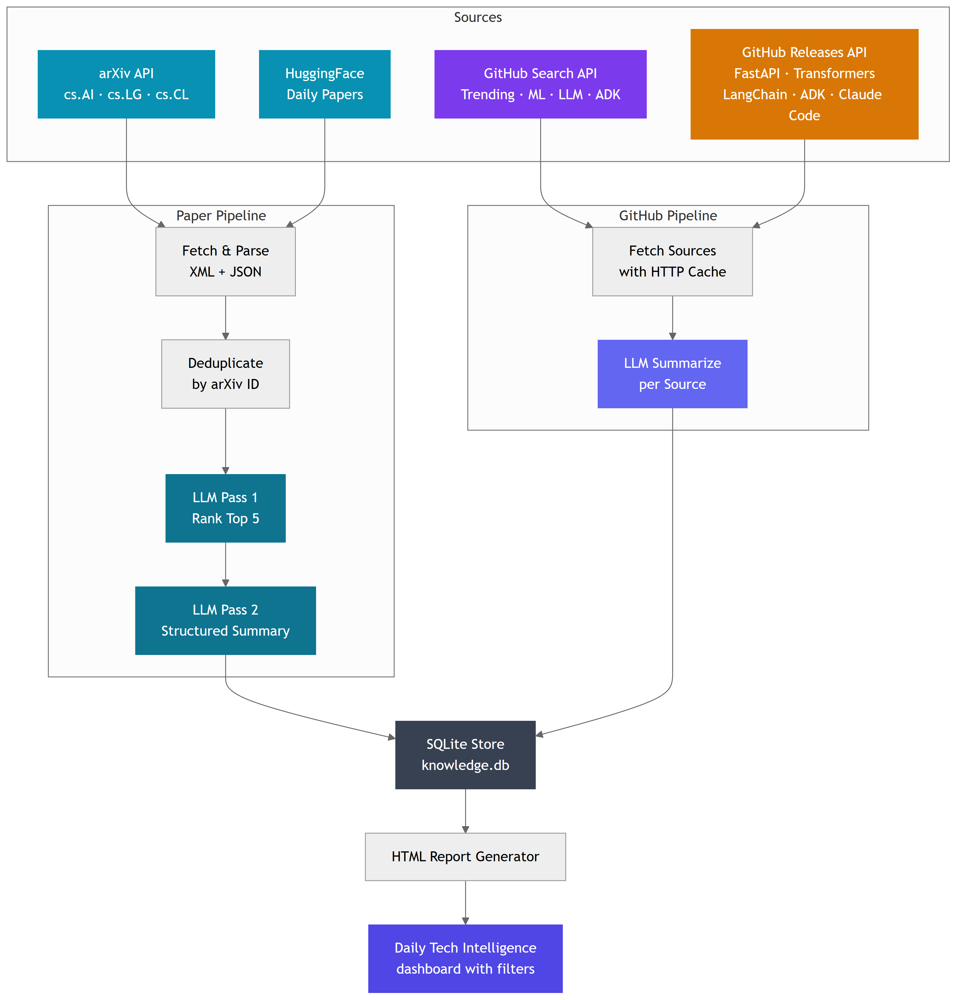

# Daily Tech Intelligence

Automated daily tech briefing that fetches trending GitHub repos, release notes, and AI research papers, summarizes them with an LLM, and generates a polished HTML dashboard.



## What It Does

Pulls data from **11 sources** every day across two pipelines, asks an LLM to distill raw data into concise developer briefings, stores everything in a local SQLite database, and renders a filterable HTML report that opens in your browser.

### Sources

| Category | What's Tracked |
|----------|---------------|
| **Research Papers** | arXiv (cs.AI, cs.LG, cs.CL) + HuggingFace Daily Papers |
| Trending Python | Newly created Python repos by stars |
| Machine Learning | Repos tagged `machine-learning` |
| LLM & Agents | Repos tagged `llm` |
| Google ADK | Repos tagged `google-adk` |
| Releases | FastAPI, Transformers, LangChain, Google ADK, Claude Code |

### Features

- **AI research papers** with two-pass LLM pipeline: ranks ~70 candidates by relevance, then generates structured summaries with methodology breakdowns and practical takeaways
- **LLM-powered summaries** with key releases, upgrade notes, and quick code examples
- **Per-source hints** that tailor the summarization (e.g. FastAPI gets SSE examples, ADK gets agent snippets)
- **SQLite storage** with `UNIQUE(source, date)` dedup -- same source won't be re-processed on the same day
- **HTTP caching** via hishel to avoid redundant API calls
- **Light-themed HTML dashboard** with category filters, color-coded cards, dedicated paper section, and responsive design
- **Today-only reports** -- each run generates a fresh daily report, not an accumulation

## Quick Start

### Prerequisites

- Python 3.13+
- [uv](https://docs.astral.sh/uv/) package manager
- GitHub token (for API rate limits)
- OpenAI API key (for LLM summarization)

### Setup

```bash
git clone https://github.com/pouriamrt/daily-tech.git
cd daily-tech
uv sync
```

Create a `.env` file:

```
GITHUB_TOKEN=ghp_your_token_here
OPENAI_API_KEY=sk-your_key_here
```

### Run

```bash
uv run python dtech.py
```

This will:
1. Fetch AI papers from arXiv + HuggingFace (deduplicate, LLM-rank top 5, generate structured summaries)
2. Fetch all 9 GitHub sources (skipping any already fetched today)
3. Summarize each with the LLM
4. Store results in `knowledge.db`
5. Generate `daily_report.html`
6. Open the report in your browser

### Test

```bash
uv run pytest tests/ -v
```

## Project Structure

```
daily-tech/
  dtech.py            # Single-file application (all logic)
  pyproject.toml       # Dependencies and tool config
  tests/               # Unit tests for paper pipeline
  .env                 # API keys (gitignored)
  knowledge.db         # SQLite knowledge store (gitignored)
  daily_report.html    # Generated report (gitignored)
```

## Configuration

All configuration lives at the top of `dtech.py`:

- **`SOURCES`** -- tuple of GitHub API URLs to fetch
- **`SUMMARY_HINTS`** -- per-source extra instructions for the LLM (e.g. "add a Quick Example section")
- **`INTEREST_PROFILE`** -- describes your focus areas for paper ranking relevance
- **`model`** -- LLM model used for summarization (default: `gpt-5.4-nano`)

## License

MIT
